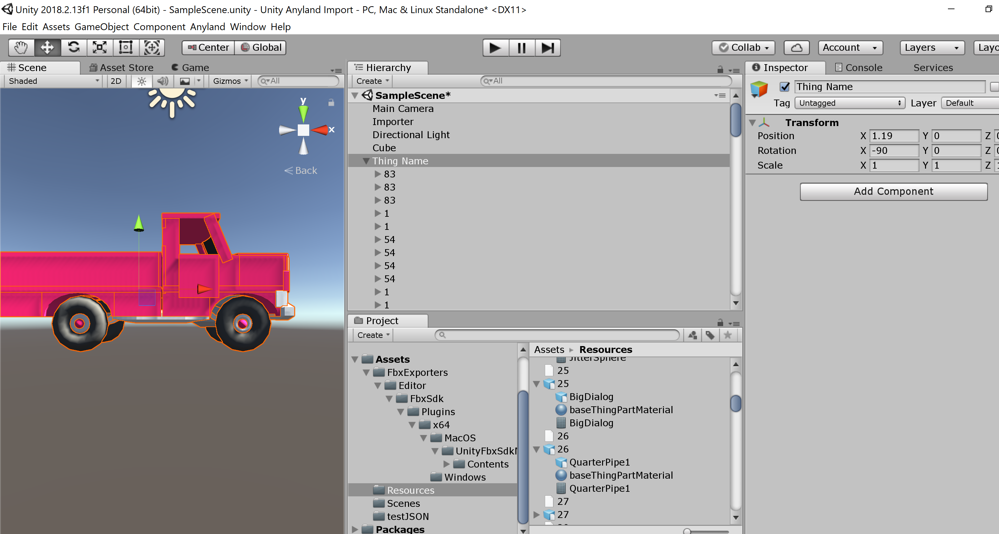

# Anyland Import Tools
Import geometry from anyland to unity and blender

Limitations
Does not apply vertex edits

# Blender
For Blender 2.79
add the folder "io_import_anyland" to Blender\2.79\scripts\addons

Open user preferences and enable Import to Anyland JSON plugin

# Unity
For Unity open the project
Goto menu Anyland - Load Json
Select file to import

